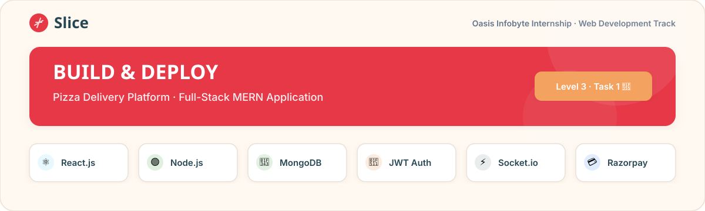
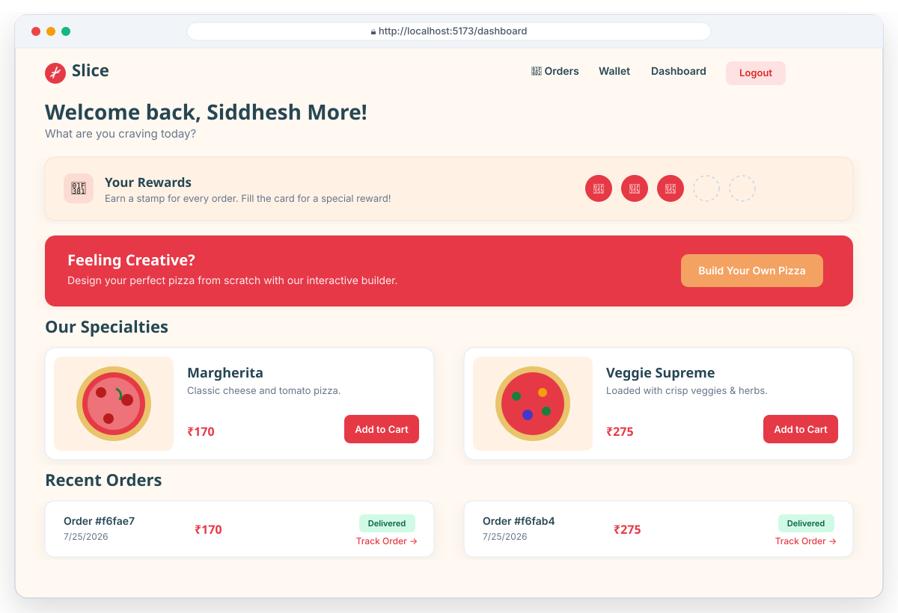
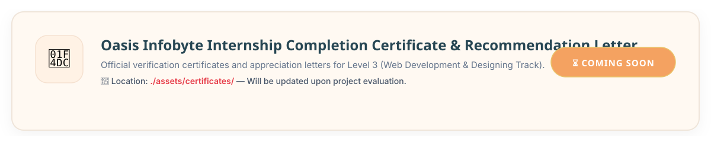
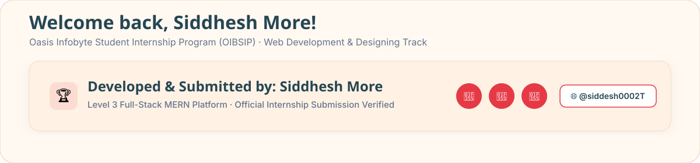

<p align="center">
  
</p>

# 🍕 Pizza Delivery Full-Stack Platform
### **Oasis Infobyte Internship (OIBSIP) — Web Development & Designing Track**
**Level 3 · Task 1: Advanced Full-Stack Application**


---

## 🌟 About the Internship

This project was developed as part of the **Oasis Infobyte Student Internship Program (OIBSIP)** under the **Web Development & Designing** domain track. 

- **Organization:** [Oasis Infobyte](https://oasisinfobyte.com/)
- **Domain Track:** Web Development & Designing
- **Assigned Level:** **Level 3 (Advanced Full-Stack Development)**
- **Task Title:** Pizza Delivery Full-Stack Application
- **Repository Naming Convention:** `OIBSIP/WebDev-L3-PizzaApp` *(Strictly adhered to official onboarding guidelines)*

---

## 💎 Where This Project Stands Out (Engineering & Architectural Differentiators)

While many intern submissions implement basic CRUD functionality, this project was architected from the ground up to reflect **production-grade software engineering standards**. Here is an explanation of what sets this implementation apart and why it stands out from typical full-stack projects:

### 1. 🏛️ Enterprise Layered Architecture (No Monoliths)
Instead of combining routing, business logic, and database operations into cluttered route files, the backend enforces a strict separation of concerns:
- **Routes Layer (`/routes`)**: Handles HTTP method binding and endpoint definitions.
- **Controllers Layer (`/controllers`)**: Validates request payloads, manages HTTP response formatting, and handles exceptions.
- **Services Layer (`/services`)**: Encapsulates core business rules, payment algorithms, and stock validation.
- **Data Layer (`/models`)**: Enforces strict Mongoose schemas with indexing and data normalization.
- **Middlewares Layer (`/middleware`)**: Standalone, reusable middleware for JWT authentication, role-based access control (RBAC), and centralized error handling.

### 2. ⚡ Transaction-Safe Atomic Inventory Operations (Data Integrity)
In e-commerce systems, race conditions can occur when multiple customers order the last remaining inventory simultaneously. When an order is confirmed in this application:
- Ingredient deductions (bases, sauces, cheeses, vegetables) are executed within a **MongoDB Atomic Transaction / Session**.
- If any single ingredient drops below zero or encounters a database error mid-order, the **entire transaction automatically rolls back**. This prevents partial stock deductions, negative inventory balances, and database corruption.

### 3. 🔒 Zero-Trust Cryptographic Payment Signature Verification
Many beginner implementations trust client-side callbacks (`onSuccess`) from Razorpay to mark an order as paid, leaving the app vulnerable to client-side manipulation or request spoofing.
- This platform enforces **Zero-Trust Security**: when Razorpay returns payment credentials, the backend independently computes an SHA-256 HMAC cryptographic signature using the `key_secret`.
- Orders are **never** marked as confirmed and stock is **never** decremented until the server-side signature match is cryptographically validated.

### 4. 🧠 Spam-Protected Automated Low-Stock Cron Alerts
The scheduled background task runner (`node-cron`) scans database inventory levels every 30 minutes to notify administrators of low stock via SMTP email (`nodemailer`).
- To prevent spamming administrator inboxes during persistent low-stock periods, each inventory item schema maintains a `lastAlertSentAt` timestamp and enforces a configurable cooldown window (e.g., 6 hours).
- Alerts are intelligently dispatched only when stock falls below the `lowStockThreshold` AND the cooldown window has elapsed or inventory levels change.

### 5. 🛡️ Enterprise-Grade Dual Token Authentication (Access + Refresh Cookies)
Storing long-lived JWTs in `localStorage` exposes applications to Cross-Site Scripting (XSS) vulnerabilities.
- This platform mirrors banking and enterprise SaaS authentication protocols by issuing short-lived **15-minute Access Tokens** in memory alongside long-lived **7-day HTTP-Only, Secure, SameSite Refresh Cookies**.
- Even if a malicious script injects into the browser, it cannot exfiltrate the user's persistent session token.

### 6. 🔄 Real-Time Lifecycle Propagation & Dynamic UI State
- Uses WebSocket / polling rooms keyed by unique Order IDs so customers watch their order transition (`Order Received` → `In Kitchen` → `Sent to Delivery` → `Delivered`) live without reloading the browser.
- The 4-step Custom Pizza Builder dynamically syncs with backend inventory state, automatically disabling out-of-stock bases, sauces, or toppings in real time to prevent invalid configurations before checkout.

---

## 🚀 Project Overview

A production-grade, full-stack pizza ordering and inventory management platform built using the **MERN Stack** (MongoDB, Express.js, React.js, Node.js). This platform features separate role-based portals for **Users** and **Administrators**, real-time order lifecycle tracking, integrated Razorpay checkout (test mode), and automated background cron jobs for inventory monitoring and low-stock email alerts.

---

## 📸 Application Live Interface & UI Showcase

Below is an interactive preview of the user dashboard, custom pizza builder wizard, and real-time order tracking interface:

<p align="center">
  
</p>

---

## ✨ Key Features

### 👤 User Portal
- **Secure Authentication:** User registration with email verification link and JWT-based authorization (short-lived access tokens + HTTP-only refresh cookies).
- **Interactive Menu Dashboard:** Browse pre-defined artisan pizza varieties with dynamic images, pricing, and descriptions.
- **Custom Pizza Builder Wizard:** A multi-step interactive wizard allowing users to build custom pizzas from scratch:
  1. **Base Selection** (Thin Crust, Cheese Burst, Whole Wheat, Neapolitan, Deep Dish)
  2. **Sauce Selection** (Tomato, Pesto, BBQ, Alfredo, Peri Peri)
  3. **Cheese Selection** (Single-select premium cheeses)
  4. **Vegetables & Toppings** (Multi-select checkboxes with live price aggregation)
  *(Out-of-stock ingredients are automatically disabled in real-time based on database inventory)*
- **Order Summary & Checkout:** Itemized price breakdown, delivery address confirmation, and secure **Razorpay Payment Gateway** integration (Test Mode with cryptographic HMAC signature verification).
- **Real-Time Order Tracking:** Live order lifecycle updates (`Order Received` → `In Kitchen` → `Sent to Delivery` → `Delivered`) without requiring page reloads.

### 🛡️ Admin Portal
- **Role-Protected Admin Access:** Separate `/admin/login` portal protected against public registration.
- **Real-Time Order Management:** Dedicated control panel to view incoming orders, filter by status/date, and update order lifecycles instantly.
- **Inventory Management Dashboard:** Grid/table view displaying real-time stock levels for bases, sauces, cheeses, and vegetables. Supports manual stock adjustments with audit logging.
- **Atomic Stock Decrementing:** Automatic transaction-safe deduction of ingredients from inventory immediately upon payment confirmation.
- **Automated Low-Stock Email Alerts:** Integrated **node-cron** background job that scans inventory every 30 minutes and sends automated warning emails via **Nodemailer** when stock drops below configurable thresholds (default: `< 20 units`).

---

## 🛠️ Technology Stack

| Component | Technologies Used |
| :--- | :--- |
| **Frontend** | React.js (Vite), React Router DOM, Axios, State Management (Zustand/Context API), Vanilla CSS / Tailwind |
| **Backend** | Node.js, Express.js, RESTful API Architecture |
| **Database** | MongoDB, Mongoose ODM (Transactions & Aggregations) |
| **Authentication** | JSON Web Tokens (JWT), Bcrypt Password Hashing |
| **Payments** | Razorpay API Integration (Test Mode, Crypto HMAC Verification) |
| **Notifications & Jobs** | Nodemailer (SMTP Email Service), Node-Cron (Scheduled Task Runner) |
| **Real-Time Updates** | WebSockets / Polling for live status propagation |

---

## 📁 Project Structure & Asset Organization

```text
WebDev-L3-PizzaApp/
├── assets/                   # Dedicated folder for screenshots & completion certificates
│   ├── screenshots/          # Application UI evidence (dashboard.png, builder.png, etc.)
│   └── certificates/         # Official OIBSIP completion & recommendation letters
├── backend/
│   ├── src/
│   │   ├── controllers/      # Route request handlers (Auth, Order, Inventory, Pizza)
│   │   ├── models/           # Mongoose schemas (User, Order, Inventory, Pizza)
│   │   ├── routes/           # Express API endpoints
│   │   ├── services/         # Business logic and database transactions
│   │   ├── middleware/       # JWT auth, admin role verification, error handling
│   │   ├── utils/            # Nodemailer SMTP setup, node-cron jobs
│   │   ├── seeder.js         # Database initialization & default admin seeder
│   │   └── server.js         # Application entry point
│   ├── package.json
│   └── .env.example
├── frontend/
│   ├── src/
│   │   ├── components/       # Reusable UI components (Navbar, PizzaCard, Wizard steps)
│   │   ├── pages/            # View pages (Login, Register, Dashboard, Builder, Admin)
│   │   ├── services/         # Axios HTTP API client setup
│   │   ├── context/          # Global Auth & Cart state providers
│   │   └── App.jsx           # Main routing & application layout
│   ├── package.json
│   └── vite.config.js
└── README.md                 # Comprehensive project documentation
```

---

## ⚙️ Setup & Installation Instructions

Follow these step-by-step instructions to run the full-stack application locally on your machine.

### Prerequisites
- **Node.js** (v18+ recommended)
- **MongoDB** (Running locally on default port `27017` or a MongoDB Atlas cloud cluster URI)
- **Git**

---

### Step 1: Clone the Repository & Navigate
```bash
git clone https://github.com/YourGitHubUsername/OIBSIP.git
cd OIBSIP/WebDev-L3-PizzaApp
```

---

### Step 2: Configure Environment Variables

Create `.env` files in both the `backend` and `frontend` directories using the reference templates below:

#### 1. Backend Configuration (`backend/.env`)
Create a file named `.env` inside the `backend/` folder and paste:
```env
PORT=5000
NODE_ENV=development
CLIENT_URL=http://localhost:5173
MONGO_URI=mongodb://127.0.0.1:27017/pizza_app
JWT_SECRET=supersecret_jwt_key_oibsip_2026
JWT_EXPIRES_IN=7d
RAZORPAY_KEY_ID=your_razorpay_test_key_id
RAZORPAY_KEY_SECRET=your_razorpay_test_secret
SMTP_HOST=smtp.gmail.com
SMTP_PORT=587
SMTP_USER=your_email@gmail.com
SMTP_PASS=your_app_specific_password
ADMIN_ALERT_EMAIL=admin@yourdomain.com
DEFAULT_LOW_STOCK_THRESHOLD=20
STOCK_CHECK_CRON=0 * * * *
```
*(Note: Replace Razorpay and SMTP credentials with your test keys / app passwords as needed).*

#### 2. Frontend Configuration (`frontend/.env`)
Create a file named `.env` inside the `frontend/` folder and paste:
```env
VITE_API_BASE_URL=http://localhost:5000/api
VITE_RAZORPAY_KEY_ID=your_razorpay_test_key_id
```

---

### Step 3: Install Dependencies & Seed Database

Open your terminal and install backend dependencies, then run the database seeder to populate default menu items, inventory ingredients, and the admin account:

```bash
# Navigate to backend directory
cd backend
npm install

# Run database seeder
node src/seeder.js
```

> [!NOTE]
> **Default Admin Credentials Generated by Seeder:**
> - **Email:** `admin@pizza.com`
> - **Password:** `password123`
> Use these credentials to access the Admin Control Panel!

Next, open a second terminal window (or tab) and install frontend dependencies:

```bash
# Navigate to frontend directory
cd frontend
npm install
```

---

### Step 4: Run the Development Servers

Start the backend API server (Terminal 1):
```bash
cd backend
npm run dev
```

Start the Vite React frontend client (Terminal 2):
```bash
cd frontend
npm run dev
```

---

### Step 5: Access the Application
- 🌐 **User Portal & Dashboard:** Open [http://localhost:5173](http://localhost:5173) in your browser.
- 🛡️ **Admin Control Panel:** Open [http://localhost:5173/admin/login](http://localhost:5173/admin/login) in your browser.

---

## 📸 Screenshots & Demo Walkthrough

As per the **Oasis Infobyte Master Onboarding Checklist (Section 1.2, Step 4)**, a comprehensive end-to-end video walkthrough and visual proof of functional modules are presented below. All UI images are organized inside the [`./assets/screenshots/`](./assets/screenshots/) folder.

### 🎥 Video Demonstration Link
> **Demo Walkthrough Video:** `[Paste Your LinkedIn / YouTube / Google Drive Video Demo Link Here]`
> *(Ensure the video starts with a 2-second static title card displaying your Full Name, Track, and Task Title).*

### 🖼️ Application Screenshot Gallery

| **1. User Dashboard & Menu** | **2. Custom Pizza Builder Wizard** |
| :---: | :---: |
| `[Add Screenshot: User Menu]` <br> *Browse pre-defined artisan pizzas* <br> `` | `[Add Screenshot: Pizza Builder]` <br> *4-step custom ingredient selection* <br> `` |
| **3. Order Summary & Razorpay Checkout** | **4. Real-Time Order Status Tracking** |
| `[Add Screenshot: Checkout Modal]` <br> *Test mode Razorpay payment verification* <br> `` | `[Add Screenshot: Live Order Status]` <br> *Lifecycle tracking: Received to Delivered* <br> `` |
| **5. Admin Inventory Management Panel** | **6. Admin Order Control Panel** |
| `[Add Screenshot: Admin Inventory]` <br> *Real-time stock monitoring & adjustments* <br> `` | `[Add Screenshot: Admin Orders]` <br> *Update customer order lifecycles instantly* <br> `` |

*(To render screenshots: save your screen images into `WebDev-L3-PizzaApp/assets/screenshots/` and replace the bracketed text above with standard markdown image links).*

---

## 🏆 Internship Certificates & Achievements

Upon successful submission and evaluation of this project, official completion records from Oasis Infobyte will be archived inside the [`./assets/certificates/`](./assets/certificates/) directory.

### 📄 Official OIBSIP Internship Offer Letter
Below is the verified official internship offer letter granted to **Siddhesh More**:

<p align="center">
  
</p>

### 🎓 Internship Completion Certificate & Recommendation Letter
Official completion certificate and appreciation letter status:

<p align="center">
  
</p>

### 📜 How to View Verified Certificates
Once issued, you can verify the authenticity of the internship completion certificate and recommendation letter by clicking the badge below or scanning the QR code on the official document:
- 🔗 **Verify Certificate Online:** `[Insert Official Verification Link Here]`
- 📄 **Download PDF Copy:** `[Insert Google Drive / PDF Link Here]`

---

## 🤝 Contributing & Peer Evaluation
As part of **Step 6 of the OIBSIP Onboarding Checklist**, constructive peer review is encouraged. Fellow interns from the cohort are welcome to review this repository, test the Razorpay checkout flow in test mode, inspect the atomic transaction architecture, and share feedback on LinkedIn!

---

## 📝 License & Acknowledgments
- Developed by **Siddhesh More** for the **Oasis Infobyte Internship Program (OIBSIP)**.
- Special thanks to the Oasis Infobyte team for providing an industry-standard full-stack development prompt and learning track.
- Powered by React, Node.js, Express, MongoDB, Razorpay, and Tailwind/CSS.

<p align="center">
  
</p>
